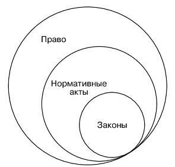

##3. Признаки и функции права

### Признаки права

Существует **8** признаков права:

1. **Нормативность.**
   Право представляет собой нормы – правила, закрепляющие типичные образцы поведения участников общественных отношений в типичных жизненных ситуациях. 
2. **Системность.**
   Право представляет собой систему, т.е. упорядоченную организованную совокупность норм, которые внутренне непротиворечивы, согласованы по своему содержанию и обеспечивают на основе единых принципов детальную регламентацию всех общественных отношений.
3. **Регулятивность.**
   Право являеться регулятором общественных отношений, т.к. представляет субъектам образцы их возможных вариантов организации отношений.
4. **Интеллектуально-волевое содержание**
   Содержание норм - описывает умственую и волевую деятельность человечества и само является результатом этой деятельности.
5. **Общеобязательность.**
   Все субьекты всязаны правовыми отношениями а нормы права являются обязательными для всех.
6. **Государственная обеспеченность.**
   Государство обеспечивает само существование права, создает условия для его реализации и принудительного исполнения его требований.
7. **Формальная определенность.**
   Все правовые нормы имеют жесткую форму определения. 
8. **Право != закон.**
   Закон есть подмножесво права. ПРаво более высокая сущьность *(моральное право и т.п.)* рис 1.

​								*Рис 1. Соотношение права и закона.*

### Функции права

Функции права - это роль, которую осуществляет право в обществе. Выделяют **2** функции права:

- **Общественная** - экономические, политические, воспитательная...
- **Юридическая** -  упорядочение общественных отношений путём закрепления соответствующих общественных связей и порядков
  - регулятивная - регулирует отношения
  - охранительная - установление мер юридической защиты и юридической ответственности
  - оценочная - позволяет праву выступать в качестве критерия правомерности

