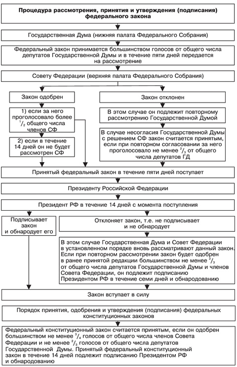

## 8. Законодательный процесс

**Законодательного процесс** - процесс создания законов, который представляет 
собой ряд последовательно осуществляемых действий (*стадий*), начиная от внесения 
законопроекта в законодательный орган до доведения его содержания до 
населения.

`Припичание:` *В российской юридической литературе называют разное число стадий – от трех до  – девяти. Данное число может быть неоднозначным и варьироваться от трактовок. Подробнее об этом читайте [тут](https://studfiles.net/preview/4364957/page:7/).*

Не умоляю общьности, в рамках данного конспекта я приведу описание состоящее из **4** пунктов:

1. **Законодательной инициатива**

   - Уполномоченный орган государства вносит в парламент предложение об издании нормативного акта или проекта подготовленного закона.
     По Конституции РФ, таким органом явлеется:
     - Президент и депутаты
     - Совет Федерации
     - Правительство и законодательные органы субъектов РФ
     - Конституционный Суд, Верховный Суд и Высший Арбитражный Суд.

2. **Подготовка законопроекта**

   - Обсуждение законопроекта в Государственной Думе
   - Правовая экспертиза
   - Заключение профильного комитета
   - Публикование для принятия

3. **Процесс принятия закона**

   - Проводится в Государственной Думме, принимается в **3** чтениях.

   1. *В первом чтении* обсуждаются основные положения законопроекта.
   2. *Во втором чтении* проводится попунктное обсуждение законопроекта, вносятся правки и коррективы.
   3. *В третьем чтении* проводится голосование либо "за" либо "против" законопроекта. Принимается положительный результат если доля проголосовавших "за" больше 0.5.

   - Через пять дней после принятия закона в Государственной Думе он передается в Совет Федерации, который может либо одобрить, либо отклонить закон.

4. **Опубликование закона**

   - Закон передается на подпись Президенту (в течении 14 дней).
   - Если Президент не успел его рассмотреть и закон вступает в силу автоматически.
   - Президент может отклонить закон и возвратить его со своими поправками и замечаниями для повторного рассмотрения Государственной Думой и Советом Федерации.

*Рис 2. Стадии законодательного процесса*.

### Источники

- Конспект лекций ИТМО. "Правоведение".
- <http://www.grandars.ru/college/pravovedenie/zakonodatelnyy-process.html>